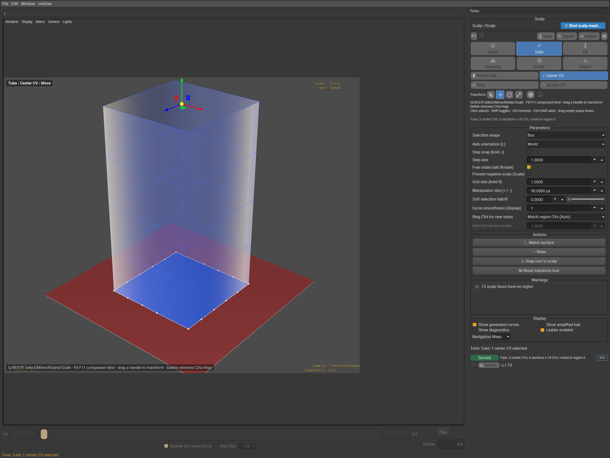
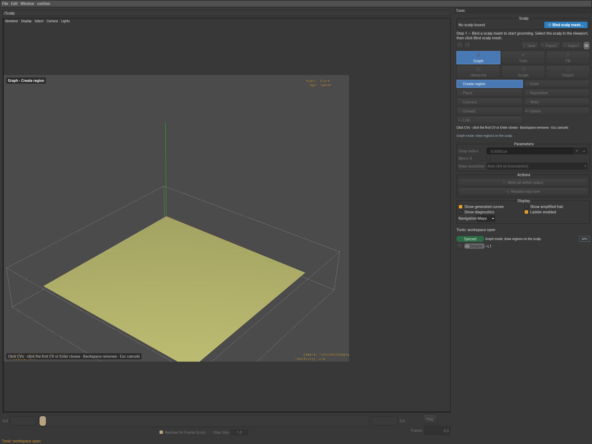

# Pomade authoring tool (usdGenPomadeTools)

A usdview plugin for authoring hierarchical grooms: draw regions on a
scalp, grow tubes, fill them with guides, subdivide into hierarchies, sculpt
and commit the result as ordinary USD (`UsdGenGroom` + `GuideInterpolate` +
`RegionMap`) that the usdGen description amplifies downstream. Tubes are
authoring-side only — no usdGen kernel reads them; the commit carries
guides, regions and maps to the stage.

Pomade is **one viewport tool**, not a menu. Almost everything an artist does
is a mode, a sub-mode, a hotkey or a panel field inside one dockable
workspace; the menu carries exactly five commands.

Every key, label, row and message below is read from the shipped code
(`pomadeModes.py`, `pomadePanels.py`, `pomadeDockIds.py`, `pomadeWorkspace.py`,
`pomadeViewport.py`, `pomadeLoopsTube.py`, `pomadeGizmoSettings.py`,
`pomadeSession.py`); `tests/checks/check_pomade_docs.py` fails when a hotkey in
those tables is missing from this page.

## Opening it

Open a stage with `bin/launch_usdview.ps1`, then, in the menu bar under
**usdGen → Pomade**:

* **Open workspace** — docks the **Pomade** panel on the right and installs
  the viewport controller (mouse and keyboard) on the active StageView.
  Needs a stage open first.
* **Bind selected as scalp** — binds the mesh selected in usdview as the
  scalp. It never asks about a saved groom (scripts drive it with no one
  to answer a box); when the stage already holds one, the status line says
  it is covered and names **Resume groom**. It does not open the dock:
  until **Open workspace** shows it, the viewport stays usdview's (a click
  picks prims, no Pomade hover or keys) and the status line says so.
* **Save groom…**, **Export center curves…**, **Import curves…** — the
  same commands as the dock's file row; see *Save, export, import*.

No other menu item exists. Everything else — modes, parameters, one-shot
actions — lives in the dock or on a hotkey.

## The dock

`PomadeWorkspace` is one right-docked panel. Top to bottom:

1. **Scalp** — `Scalp: /path` (or `No scalp bound`), the accent
   **Bind scalp mesh...** button and, only when the stage holds a saved
   groom and nothing is live, **Resume groom**.
2. **File row** — Undo and Redo (icon buttons whose tooltip names the step,
   e.g. `Undo Tube center (Ctrl+Z)`), then **Save**, **Export**, **Import**
   and **Settings** (scrolls the dock to the active mode's Parameters).
   They are there in every mode.
3. **Mode shelf** — six buttons in a 3 × 2 grid, glyph over label; the
   number key is in each tooltip.
4. **Sub-mode shelf** for the active mode (glyph beside label, two columns;
   hidden in Output). Tube shows its **component row** instead: **Whole
   tube**, **Center CV**, **Ring**, **Section CV** (`F8`–`F11`).
5. **Transform row** (Tube and Hierarchy) — icon-only **Select / Move /
   Rotate / Scale** (`Q` / `W` / `E` / `R`), then the **Global/Local**
   orientation toggle (`L`) and the **group pivot** toggle (`P`,
   Rotate/Scale only). In Hierarchy the tool buttons make the same jump to
   Tube that `W`/`E`/`R` make.
6. **Instruction line** — what the pointer and keys do in this tool (the
   `pomadeModes.HINTS` text), with the selection-modifier line under it in
   Tube, Fill and Hierarchy; below it the tool's own one-line summary
   (counts, brush radius, density...).
7. **Parameters** — a form generated from `pomadePanels.descriptors`, with
   units, ranges and a tooltip on every row; values are read from and
   written to the model live.
8. **Actions** — the mode's one-shot buttons (a button with a key shows
   it, e.g. `Subdivide (Shift+D)`).
9. **Warnings** — hidden while empty; see *Warnings*.
10. **Display** — **Show generated curves**, **Show amplified hair**,
    **Show diagnostics**, **Ladder enabled** and **Navigation**
    (host pointer presets).
11. **Status strip** — the message area, the sync pill, the tool summary,
    the `GPU`/`CPU` chip, the breadcrumb and (with Show diagnostics) the
    version line; see *Status strip*.

The dock refreshes after every publish and on a 250 ms timer while visible.
Each mode builds its pages once and keeps them, so a mode switched with a
number key over the viewport is the mode the dock shows. Each mode
**remembers its last sub-mode**: leaving Graph in Draw and coming back
returns to Draw (the default applies only the first time).

While the dock is visible it suppresses StageView rollover picking and its
hover tooltip so Pomade owns hover feedback; hiding the dock restores the
prior setting and suspends the controller, showing it resumes. Suspended,
the StageView gets back usdview's own mouse tracking and focus policy (a
click on it no longer takes the keys from usdview's search field), and the
idle commit pump waits for the dock to show again; a controller installed
with no dock on screen (a menu bind) starts suspended.

### First run

With no scalp bound the dock shows `No scalp bound`, the blue default
button **Bind scalp mesh...** and the line *Step 1 — Bind a scalp mesh to
start grooming. Select the scalp in the viewport, then click Bind scalp
mesh.* The mode shelf, sub-mode shelf, transform row, Parameters, Actions,
Warnings and Save/Export/Import are greyed out, and a mode key says
`Pomade: bind a scalp mesh first` instead of entering a tool that cannot do
anything. The sync pill reads `No scalp bound` (grey), and the viewport HUD
and the dock's instruction line read *Bind a scalp mesh to start* instead
of a tool's name and click recipe.

**Bind scalp mesh...** binds the stage's only Mesh straight away, or opens a
picker (*Choose the scalp Mesh:*) when there are several; the selected
mesh is the initial choice. A mesh that fails validation (points, faces of
three or more vertices, indices inside the point list) is refused with a
dialog. Binding shows a wait cursor, starts the commit and bake workers
and switches to Graph. Replacing a bound, edited scalp asks **Replace bound
scalp** first because it clears that groom's regions and maps. When the
stage already holds a saved groom for the mesh, the dock asks *Saved groom
found*: **Resume** (edit that groom), **Start new** (an empty groom that
covers it until you save over it) or **Cancel** (nothing happens).

## The mode shelf (`1`–`6`) and sub-modes

| Key | Mode | Sub-modes / component kinds | Tools |
|---|---|---|---|
| `1` | Graph | Create region `R`, Draw `D`, Place `P`, Reposition `M`, Connect `C`, Weld `W`, Unweld `U`, Delete `X`, Link `L` | — |
| `2` | Tube | Whole tube `F8`, Center CV `F9`, Ring `F10`, Section CV `F11` | Select `Q`, Move `W`, Rotate `E`, Scale `R`; orientation `L`; group pivot `P`; size `+` / `-` |
| `3` | Fill | Params `P`, Length ramp `V` | — |
| `4` | Hierarchy | Navigate `N`, Subdivide `D`, Merge `M`, Group `G`, Levels `L` | `Q` / `W` / `E` / `R` jump to Tube with the tool |
| `5` | Sculpt | Grab `G`, Smooth `S`, Comb `C`, Lengthen `L`, Twist `T` | — |
| `6` | Output | — (panel only, no viewport gesture) | — |

Number keys work whenever no text field has focus. Sub-mode letters,
brackets, `Delete`, `Backspace` and the Tube keys need the pointer over the
viewport, so typing in the outliner or a dock field is never stolen.
Switching modes drops any live gesture; leaving a mode takes its gizmo,
brush ring and hover highlight off screen.

In Tube, `F8`–`F11` **convert** the selection to the new kind instead of
dropping it (component conversion): a section CV becomes its ring, a
ring the center CV that owns it, a center CV its whole tube, and back down
(a ring to its section CVs, a center CV to its rings). A whole tube
converted to a component kind stays as the *owner set*: component clicks
only pick that tube's components until you click another tube's body.

## Hotkeys

| Key | Action |
|---|---|
| `Escape` | Cancel the live gesture, restoring the press-time shape exactly. With nothing live it drops an idle draft (Graph region draft, first pick of a two-click tool, Hierarchy's recorded split edge or an armed Re-subdivide) and **never** clears the selection. A focused text field owns Escape. |
| `Ctrl+Z` | Undo. |
| `Ctrl+Y`, `Ctrl+Shift+Z`, `Shift+Z` | Redo. |
| `Ctrl+A` | Select everything of the active mode's kind the view shows (graph nodes, the Tube component kind, tubes in Fill/Hierarchy). |
| `Ctrl+Shift+A` | Deselect all. |
| `Ctrl+I` | Invert the selection within the view. |
| `Delete` | Delete the selection: graph nodes and edges (Graph); center CVs, else rings, else whole tubes (Tube); whole tubes with their subtrees (Hierarchy; an on-the-fly group parent goes alone and its members stay). An L1 root tube is refused — its graph region owns it; delete the region in Graph. A tube keeps at least 2 center CVs and 2 rings: removals past that are refused with the reason, and a Delete whose every removal is refused leaves no undo step and keeps the selection. |
| `Backspace` | In Graph's Create region draft, remove the last CV; everywhere else, exit to the level above (as `Ctrl+Up`). |
| `Enter` | Close the Create region draft (three or more CVs). |
| `[` / `]` | Shrink / grow the mode's radius: snap radius (Graph), soft-selection falloff (Tube), preview fraction (Fill), pick radius (Hierarchy), brush radius ×1.15 (Sculpt). |
| `Shift+D` / `Shift+M` | Subdivide / merge children of the selected tube(s), from any mode. Outside Hierarchy, a Shift+M over tubes with no children (or a Shift+D whose every split is refused) says so and leaves no undo step. |
| `Ctrl+Down` / `Ctrl+Up` | Enter the level below / exit to the level above. |
| `Shift+W` / `Shift+U` | Weld the two selected graph nodes / unweld the selected shared node. |
| `Ctrl+Shift+S` | Save groom (file dialog). |
| `F` | Frame the Pomade selection (usdview's own Frame Selected when Pomade has nothing selected). In Sculpt, hold `F` and drag left/right to resize the brush; a tap still frames, and with nothing selected Sculpt frames the whole groom. |
| `Q` / `W` / `E` / `R` | Tube: Select / Move / Rotate / Scale tool. Hierarchy: `Q` / `W` / `E` / `R` switch to Tube (Whole tube) with that tool, keeping the selected tubes, as the transform row's buttons do. |
| `F8` / `F9` / `F10` / `F11` | Tube component kind: Whole tube / Center CV / Ring / Section CV. |
| `L` | Tube: flip the Axis Orientation World ↔ Tube (local). |
| `P` | Tube, Rotate/Scale: cycle the group pivot Individual Origins ↔ Selection Centre. |
| `+` / `=` / `-` | Tube: manipulator size ×1.1 / ÷1.1 (20–400 px). |
| `J` (hold) | During a gizmo drag only: step snap. |
| `X` (hold) | During a gizmo drag only: snap the pivot to the world grid. |
| `Alt`-drag / `Meta`-drag | Always usdview's camera, in every mode. |

`J`, `X`, `L`, `P` and `F` are shared with usdview; Pomade claims them only in
the states above (a live drag for `J`/`X`, Tube for `L`/`P`, a Pomade
selection or a Sculpt hold for `F`), otherwise usdview's own binding runs.
Undo and redo refuse while a drag is live (`Pomade: finish the drag before
undo`), and the dock's Undo/Redo buttons grey out for the drag. That includes
a held dock slider (Density, Edge bias): the session and the model both
refuse the step while its bracket is open.

## Selection, gizmos and gestures

### The one selection-modifier table

Every click, box and lasso in every mode that selects uses one table
(`pomadeLoops.selectModeFor`):

| Gesture | none | `Shift` | `Ctrl` | `Ctrl+Shift` |
|---|---|---|---|---|
| click | replace | toggle | remove | add |
| box / lasso | replace | add | remove | add |

The dock repeats it as *Click selects · Shift toggles · Ctrl removes ·
Ctrl+Shift adds · drag empty space boxes*. A drag that starts on empty
space draws a box (Tube's **Selection shape** can make it a lasso); the
band is tinted by what it will do — blue replace, green `+` add, red `−`
remove. A band edits the selection live as it grows; a release with no
travel is a click. A plain click on empty space clears the selection
(Hierarchy, Tube, and Graph's click tools).

Viewport feedback: the top-left HUD reads `Mode › Sub-mode › Tool`, the
bottom-left repeats the instruction line, and an amber chip names the
fallback rung while the ladder has reduced detail. The cursor says what a
press will do — a cross for drawing tools and bands, a four-way arrow over
a gizmo handle, a closed hand while dragging, no cursor under Sculpt's
brush ring. Selection, hover and gizmo changes redraw at once; a drag never
touches the stage — only the release enqueues a commit.

### Graph — draw regions on the scalp

Regions are the foundation; start here after binding. Graph opens in
**Create region** (`R`). Click successive positions on the scalp to place
transient CVs; click the first CV (from three CVs on, the rubber band snaps
to it and says *click to close*) or press `Enter` to close the contour as
one region and one undo step. `Backspace` removes the last uncommitted CV;
`Escape` discards the draft. A closed region is rasterised and receives its
L1 root tube automatically. Clicking within an existing graph CV's pick
radius reuses that exact graph node, including one shared by another
region, so neighbouring regions share one boundary.

* **Draw** (`D`) — press-drag a stroke; release commits it. Ends within the
  snap radius of a node or edge weld automatically; a stroke that closes on
  itself splits the region it crosses.
* **Place** (`P`) — click empty scalp to add a node; drag an existing node
  to move it (dropping it on a node or an edge welds or splits into it).
* **Reposition** (`M`) — drag an existing graph CV or a whole edge along the
  scalp. A rigid whole-region move carries the attached tube and all
  subdivided descendants by one translation/rotation, preserving sculpted
  centers, sections and child offsets while the base stays aligned to its
  support plane. When a CV or edge move changes the region footprint, the
  tube base is refit to it, upper sculpting is retained and generated
  subdivided attachments are refreshed; an imported tube with an explicit
  authored shape is preserved. A shared boundary updates both owning
  subtrees. Empty clicks do nothing and this tool never auto-welds. The
  live preview is one undo step; `Escape` cancels it to the press-time
  shape. A grab that never moved leaves no undo step.
* **Connect** (`C`) — click two nodes in turn to join them with a geodesic
  edge.
* **Weld** (`W`) / **Unweld** (`U`) — click two nodes to merge them, or a
  shared node to split it back per region (`Shift+W` / `Shift+U` do the
  same to the current selection). The status names the nodes the split
  made and, when it opened a region's boundary, the region count before
  and after; a node only one region uses has nothing to split, and Unweld
  says so and leaves no undo step.
* **Delete** (`X`) — click a node, else an edge, to remove it.
* **Link** (`L`) — click two regions in turn to share one interpolation id.

In the two-click tools the first pick is shown selected; `Escape`, a
sub-mode change or finishing the action drops it. A press on empty space in
Connect/Weld/Unweld/Delete/Link starts a node box, and any `Shift` or
`Ctrl` press in any Graph tool is a node selection click or box through the
modifier table — no Graph authoring gesture reads them. Every committed edit
re-rasterises the graph and gives newly closed regions their tube stub
inside the edit's one undo step (one `Ctrl+Z` takes back the edit and the
stub it grew), then enqueues a commit and a map bake and refreshes the
warnings.

Parameters: **Snap radius** (1–64 px, in screen pixels: a stroke end or
**Weld all** converts it to scalp units at the current zoom), **Mirror X**,
**Bake resolution** (`Auto (64 on boundaries)`, or an explicit `4 x 4` …
`4096 x 4096` texels per scalp face side; the same row as Output, and a
change rebakes at once). Actions: **Weld all within radius** (one undo
step; none when no pair is in range), **Rebake map now**.

### Tube — sculpt center curves and section rings

Each closed region grows one L1 tube, including a region occupying only part
of a coarse scalp face. Root sampling tests the graph region itself, so
separate subface regions keep separate root support. New region tubes
default to **Ring CVs for new tubes** = `Match region CVs (Auto)`: one
longitudinal column per ordered region CV, the base following the polygon's
projected fitted support plane. A higher count adds edge controls while
preserving the region corners; existing sculpted tubes are not regenerated
when it changes. Regions with more than 32 CVs keep their authored graph and
report the 32-CV construction limit.

A new region stub is a braid profile, written into the section scales the
committer stores. It authors three section rings: the root at t = 0, the
belly at t = 0.50, and the tip. The first ring is the growth footprint
(scale 1.05) and its center sits on the growth surface, so the tube
leaves the scalp as a base rather than a pinched neck. Scale peaks at
3.40 on the belly ring and settles to a still-plump 2.00 at the tip.
The belly center leaves along the surface normal, so the root ring stays
in the tangent plane. The tip drops along the hang — world-down when down
lies in the tangent plane. The bulb between those three rings is the
display interpolant: the radius eases toward the wider ring, and the
center follows a smooth curve, eight spans by default, so the shell fills
out instead of ruling a straight taper. In Tube mode the focused body is
a solid shaded mesh. When the scalp
has one region and that region is a small patch on a large surface,
building the stub first moves the region's graph nodes outward on the
scalp, so the tint covers a broad cap (about seven tenths of the scalp
radius). The first ring stays seated on that cap. A region that already covers a fair
share of the scalp stays where it was drawn, and so does a region that
shares its boundary with another region. Undo of the stub puts the moved
region back.

The component row picks what a click selects: **Whole tube** (`F8`, the
body), **Center CV** (`F9`, the default), **Ring** (`F10`) or **Section CV**
(`F11`). Selecting or hovering a component also highlights its owning tube,
child tubes included. A drag on the body in a component kind draws a
component box rather than grabbing the whole tube. `Delete` removes selected
center CVs, else selected rings, else (Whole tube) the selected tubes.

The transform tool (`Q`/`W`/`E`/`R`) is the gizmo, drawn at the selection's
pivot:

| Tool | Gizmo | Handles |
|---|---|---|
| Select `Q` | none | click and drag only select |
| Move `W` | arrows with filled cones, three planar squares, a centre square | axis = along it; plane square = in that plane; centre = the camera plane |
| Rotate `E` | three rings (front halves), a camera-facing view ring, a free-rotate ball | ring = about its axis (a pie wedge shows the sweep, in whole steps while step snap is on); view ring = about the view axis; ball = trackball |
| Scale `R` | axes ending in filled cubes, planar squares, a centre square | axis = one axis; plane = its two axes; centre = uniform, horizontal travel only (right grows, left shrinks; one manipulator size is 2×; past zero it mirrors unless **Prevent negative scale**) |

In **Ring** the Move tool is the ring gizmo: u/v arrows, planar square and
centre move the ring in its own plane, the outer circle scales it and the
w arrow twists it; Rotate twists about the ring normal and Scale scales in
the ring plane. **Section CV** acts inside the ring plane. Ring and Section
always use the ring's own frame.

| Handle | Colour | Drag | Modifier during the drag |
|---|---|---|---|
| X / Y / Z axis | red / green / blue | along the axis (Move), about it (Rotate), one axis (Scale) | `Ctrl`: Move in the plane **perpendicular** to the axis |
| planar square | coloured like its normal axis, half filled | in that plane / its two axes | — |
| centre square | light blue | camera plane (Move), uniform (Scale) | `Ctrl`: along the tube's root normal (Center CV / Whole tube only) |
| view ring | light blue | about the view axis | — |
| free ball | grey wash | trackball rotate | — |
| ring (Ring Move) | pale grey | scale the ring | — |
| any, hovered | pale yellow | shows what a press will grab | — |
| any, dragging or last dragged | yellow | — | `Shift`: precision (a tenth of the travel); `J`: step snap; `X`: grid snap |
| any, ungrabbable | its colour at 40 % | edge-on axis or plane, or a pinned root | — |

A handle **wins the press** even over a CV dot inside its tolerance, and the
last-dragged handle stays yellow so a **plain middle drag anywhere repeats
it** (the Alt-drag navigation preset), unless the camera has since turned that handle
edge-on (dimmed, ungrabbable): then the middle drag is left to the camera.
With Move and no modifier, pressing an
unselected component (or, in Whole tube, a tube body) **selects it and
drags it in the same gesture**
(tweak); a release without travel is a plain click, leaves no undo step and
lights no handle (the last-dragged handle stays what it was).
`Ctrl`/`Shift`-clicking the selected component (or tube) under the centre square
without moving is a selection click, not a drag. A Tube double-click grows
the selection one step: center CV → its tube, section CV → its ring, ring →
every ring of its tube.

While a drag runs, a readout beside the gizmo (and the status line) reads
`Move X 0.420`, `Move XY 0.420`, `Rotate 23.4°`, `Scale 1.25` or
`Twist 12.0°`, followed by ` · Shift precision`, ` · snap step 15` or
` · grid 1` when those shape the value. A selected root CV alone keeps
Move but is **pinned** for Rotate/Scale: the gizmo stays dimmed and the
status line says *Root CV is pinned: Rotate/Scale act on CVs above the
root. Select the tube (F8) to transform it whole.*

Rotate and Scale transform each selected owner about its own pivot (the
root, or the ring centre) — **Individual Origins**, the default — with the
gizmo drawn at the lead owner's; `P` (or the group-pivot toggle) switches to
**Selection Centre**, one pivot at the middle of the selection where the
gizmo is then drawn. Move always moves everything by one delta. Selected CVs
spread with the **Soft selection falloff** around the clicked CV. Guides
refill at the preview density on every move and at full density on release;
`Escape` restores the press-time shape and guides bit-exactly.

Parameters: **Selection shape** (Box / Lasso), **Axis orientation (L)**
(World, Screen, Tube (local); each tool remembers its own — Move and Scale
start World, Rotate Tube), **Step snap (hold J)**, **Step size** (1.0 for
Move, 15° for Rotate, 0.1 for Scale), **Free rotate ball (Rotate)**,
**Prevent negative scale (Scale)**, **Grid size (hold X)** (1.0),
**Manipulator size (+ / -)** (90 px, 20–400), **Soft selection falloff**,
**Curve smoothness (display)** (default 8 spans between each pair of
section rings: the shell swells between those rings, and each authored
section stays on its own row), **Ring CVs for new
tubes**, **Selected section scale** (uniform scale for the selected rings,
greyed with none).
Gizmo settings are per session and not saved. Actions: **Match surface**
(snaps each tube's root CV onto the scalp, the rest of the curve stays),
**Relax** (smooths kinks out of the center curve, root and tip held),
**Snap root to scalp** (translates the whole tube so its root sits on the
scalp) — each on the selected tubes, or the primary tube with none
selected, as one undo step; a click that moves nothing says `no change` and
leaves no undo step — and **Reset transform tool** (the current tool's step
and snap settings back to defaults).

### Fill — guide density and the length ramp

Entering Fill with no guides grows them, so there is something to see.

* **Params** (`P`) — click a tube to select it for the form (a box selects
  several); the fields then apply to the selection, or every tube with none
  selected. Clicking a guide says *strands belong to the tube they grow
  from; click the tube*.
* **Length ramp** (`V`) — press on a tube and drag up for longer, down for
  shorter guides at the radial position under the cursor: the pressed
  strand's root, or where the press sits across the tube (centre 0, wall 1).
  Knots snap to a 0.05 grid and hold a fraction of full length from 0 to 1,
  so dragging up only lengthens guides the profile has already shortened
  (a full-length knot says `(full length)`). A drag over the whole 240 px
  range covers 0 to 1. The status line reads
  `Pomade Fill: length ramp r=0.35: 0.80`. The pressed tube is edited (with
  the rest of the selection when it is part of it); release refills at full
  density; `Escape` restores the selection and ramp.

Fill carries each root through the actual section polygons, including their
CV positions, scale and twist. The length profile is a function of the
root's radial position in the root ring, after the edge-bias remap: each
guide grows the profile's value at that position (clamped to 0–1) of the
full length. At full length the guide tips follow the last ring; a shorter
profile ends inside the corresponding section interval.

Parameters: **Density** (0.1–1000 guides /unit², with the live `N guides`
count under it), **CVs per guide** (2–64), **Edge bias** (−1 middle … +1
wall), **Seed**, **Length profile** (`pos:val` pairs, radial position to
length fraction, such as `0:1, 0.5:0.6, 1:0.8`; values above 1 act as 1;
empty is full length; an invalid entry turns red and is not applied), **Preview density while dragging** (%), **Freeze roots**.
Dragging the Density or Edge bias slider is one undo step. Actions:
**Refill guides**, **Clear generated curves** (removes generated guides but
keeps authored tubes; undoable; automatic refill stays off until **Refill
guides**). Hidden generated curves are not pick targets.

### Hierarchy — subdivide and navigate levels

A click selects a tube (with the modifier table); a drag on empty space
boxes tubes; a click on empty space deselects. A **double-click** enters the
clicked tube's branch and selects its children; `Backspace` or `Ctrl+Up`
exits. `W`/`E`/`R` jump to Tube with the tubes still selected.

* **Navigate** (`N`) — select and walk levels.
* **Subdivide** (`D`) — with **Split mode** `K-means`, `Shift+D` or
  **Subdivide** splits each selected tube into **Subdivide count** (2–8)
  children by **Subdivide seed**; the children become the selection and
  focus moves to their level. With `Edge`, first drag a stroke across the
  tube — a live line follows the drag and the recorded edge stays drawn
  until `Shift+D` consumes it (`Escape` clears it; very short strokes are
  refused).
* **Merge** (`M`) — a click on a tube folds its children back
  (`Shift+M` / **Merge children**; a visible child folds its siblings into
  their parent). **Merge selected** folds two or more selected siblings
  into one.
* **Group** (`G`) — a plain box groups what it caught under an on-the-fly
  parent; modifier boxes just gather the selection for the **Group**
  button. **Make persistent** commits a group into the groom.
* **Levels** (`L`) — a click solos the clicked tube's level; clicking one of
  its tubes again un-solos.

**Re-subdivide** is a two-press confirm: the first press arms it and the
button turns amber, reading *Confirm re-subdivide (discards child sculpt)*;
the second press does it; `Escape` or a different selection disarms it. A
refused or failed action says why and leaves no undo step. If a parent's
children were merged but its re-split is refused, the whole Re-subdivide
rolls back (every selected parent keeps its children) and the status line
names that parent.

The breadcrumb at the foot of the dock (exit arrow, `Groom › Tube 0 › L2
(4 children)`) is clickable; **Enter level** / **Exit level** (also
`Ctrl+Down` / `Ctrl+Up`) walk the focus. Entering a selected tube's child
level selects its children; exiting restores the parent selection.
**Lock parents** / **Lock children** gate parent/child propagation per selected
tube, or globally with none selected. With tubes selected the boxes show
and set those tubes' own flags (part-checked when they disagree; a click
sets them all); with none selected they show and set the default for every
tube. Lock children makes a parent edit carry its children along rigidly;
Lock parents leaves the parents where they are when a child is edited.

Levels are branch-local. Entering root A exposes only A's children, so a
separate root B can stay at its frontier; the view can show A at L2 while B
stays at L1. Whole-tube Move applies one atomic translation; parent updates
preserve each child's sculpted centers, sections, offsets and individual CV
offset slots. The parent layout inherits only the original outer boundary
from L1; internal sibling edges and added L2 detail remain child
edits, with no full-volume refit. Holding a boundary is exact when the
target is coplanar with existing L1 sections; bent or non-coplanar inherited
edges use the planar sections' projection.

Parameters: **Subdivide count**, **Split mode**, **Subdivide seed**, **Lock
parents**, **Lock children**, **Solo level** + **Level to solo**, **Show all
levels** + **Show levels up to**, **This level visible**, **This level
see-through**. `[` / `]` change Hierarchy's own pick radius (Fill picks with
the same radius, but its brackets change the preview fraction), never
Graph's snap radius. Actions: **Subdivide (Shift+D)**,
**Merge children (Shift+M)**, **Merge selected**, **Re-subdivide**,
**Group**, **Make persistent**, **Enter level (Ctrl+Down)**, **Exit level
(Ctrl+Up)**.

### Sculpt — hierarchical brushes over center curves

A screen-facing brush ring follows the cursor over the scalp or a tube; it
is the cursor. A press picks the center CVs inside the brush radius, or the
visible tube body under it; a press with no tube under the brush is an
honest miss (*no tube under the brush*), not a stroke, and never a usdview
pick. Every move strokes the chosen tube:

* **Grab** (`G`) — CVs follow the cursor's world-space delta.
* **Smooth** (`S`) — relaxes each CV toward its neighbours' mean.
* **Comb** (`C`) — a fixed push per move along the drag, independent of
  speed.
* **Lengthen** (`L`) — drag up/down to grow/shrink, root pinned.
* **Twist** (`T`) — drag right/left to rotate offsets about the chord axis.

At press Sculpt freezes the active plane and camera/depth context for the
stroke. `Escape` restores the pre-stroke shape bit-exactly; a stroke that
changed nothing leaves no undo step. Resize the brush with `[` / `]`
(×1.15 per press) or hold `F` and drag horizontally (the status line reads
the radius live). Sculpt has no one-shot action.

Parameters: **Brush radius** (2–512 px), **Whole strand** + **Brush reach**
(untick Whole strand to limit how far along the strand the brush reaches),
**Preserve length**, **Brush strength** (0–4; Smooth 0–1), **Mirror X**.

### Output — the hair description, no gesture

No sub-mode shelf, no viewport loop. Output is a result view: tube walls,
center controls and guide helpers are hidden so they cannot occlude the
generated strands. **Build hair description** turns the guides into the
renderable usdGen hair under `/PomadeGroom/Output` and keeps it updated as you
groom: it writes sparse tube-shape guides to `<groom>/OutputCurves`, bakes
their ownership into `<groom>/OutputRegionMap` and creates the instanced
description under `<groom>/Output`, whose `CurveSource` interpolates strands
from the sparse guides at cook time, followed by `Width`. After the first
build, tube, region and Sculpt edits regenerate the output on commit while
the model is live; a saved sparse output generates hair without the model.

Parameters: **Bake resolution** (the Graph row), **Strand density
multiplier** (1 uses each tube's Fill density; other values scale the strand
count without changing the sparse curves), **Strand width** (units) — both
greyed with *Build the hair description first* until it exists — and **Show
amplified hair** (the same switch as Display › Show amplified hair; it only
controls visibility, off keeps the viewport on the guides, which is faster).

`Auto` bakes 64 × 64 on faces a region border crosses and one texel inside a
region; an explicit resolution forces that many texels per face side over
the whole scalp. It costs what it says: on the 64-face reference scalp a
bake is about 43 ms at 128 and about 1 s at 1024 — a debugging and
hero-bake control, not something to leave on.

## Coming from a host application

The Tube gizmo is the RigExec manipulator (ported into `pomadeGizmoScreen.py`),
so it behaves the way a host application's manipulator usually does:

* **Hit priority.** A handle under the cursor wins the press — centre, then
  planes, then axes, then rings — even when a CV dot sits inside its
  tolerance; hover pre-highlights exactly what a press will grab. Off every
  handle, the press selects.
* **Colours.** X/Y/Z are red/green/blue in every orientation; a hovered
  handle turns pale yellow, the dragged (and last-dragged) one yellow.
* **Orientation.** World (default for Move/Scale), Screen, or Tube — the
  tube's own root frame (default for Rotate); `L` flips
  World ↔ Tube.
* **Tweak.** Press-drag on an unselected CV, ring or (Whole tube) tube body
  selects and moves it in one gesture.
* **Selection modifiers.** Shift toggles, Ctrl removes, Ctrl+Shift adds
  (the Alt-drag preset); a Shift box extends and a Ctrl box subtracts
  (the middle-mouse preset).

| Behaviour | Alt-drag preset | Middle-mouse preset | Pomade |
|---|---|---|---|
| Select / Move / Rotate / Scale | `Q` `W` `E` `R` | `G` `R` `S` (modal) | `Q` `W` `E` `R` + the transform row |
| Handle wins over the component under it | yes | yes | yes |
| Hover pre-highlight | yellow | lighter | pale yellow |
| Selected / dragged handle | yellow | white | yellow, kept after release |
| Axis colours | red / green / blue | red / green / blue | red / green / blue |
| Move tip / Scale tip | cone / cube | cone / cube | cone / cube |
| Plane handles | squares | squares | half-filled squares |
| Uniform scale (centre square) | horizontal travel, 1 + dx / size; mirrors past zero unless Prevent Negative Scale | `S`, distance from the pivot | as the Alt-drag preset (**Prevent negative scale**) |
| Constrain to the plane perpendicular to an axis | `Ctrl` + axis | `Shift` + axis key | `Ctrl` + axis |
| Precision drag | — | `Shift` | `Shift` (a tenth of the travel) |
| Step snap while dragging | `J` hold | `Ctrl` | `J` hold, or **Step snap** |
| Grid snap | `X` hold | increment snap | `X` hold (**Grid size**) |
| Manipulator size | `+` / `-` | preferences | `+` / `-` (**Manipulator size**) |
| Global / Local | tool settings (RigExec binds `L`) | orientation menu | `L`, the Global/Local toggle |
| Pivot for a multi-selection | tool settings (RigExec binds `P`) | pivot menu | `P`: Individual Origins / Selection Centre |
| Repeat the last handle | middle drag anywhere | — | middle drag anywhere (Alt-drag preset); declined while that handle is edge-on |
| Cancel a drag | `Escape` | `Escape` / right-click | `Escape` |
| Frame the selection | `F` | numpad `.` | `F` |
| Orbit / pan / dolly | `Alt` + LMB / MMB / RMB | MMB / `Shift`+MMB / `Ctrl`+MMB | `Alt` always; the middle-mouse preset also adds MMB / `Shift`+MMB / `Ctrl`+MMB |

**Navigation** in the Display group picks the style. **Alt-drag preset**: `Alt`+LMB
orbits, `Alt`+MMB pans, `Alt`+RMB dollies (usdview's own camera); a plain
middle drag repeats the last gizmo handle in Tube. **Middle-mouse preset**: plain MMB
orbits, `Shift`+MMB pans, `Ctrl`+MMB dollies, and `Alt` still works; the
middle button is always the camera. In both styles a right press over the
workspace never opens usdview's prim context menu, a second button during a
drag is ignored, and the wheel is ignored mid-drag so the camera the drag
was measured with cannot move under it.

## Warnings

The list is hidden while empty. Each row carries a severity glyph (the
`status_error`, `status_warning` and `status_info` icons; Qt's message-box
icons if the art is missing), and a row with a pointing-hand cursor does
something when clicked; its tooltip ends with what (*click to select*,
*click to retry commit*, *click to outline the faces*):

| Severity | Row | Click |
|---|---|---|
| error | `Commit failed: <reason>` | **Retry commit** (enqueues the model again) |
| warning | `N tube(s) produced no guides (T3, ...): <reason>` | selects those tubes |
| info | `N scalp faces have no region` (coarse face-centre check) | outlines the uncovered faces in red on the scalp |
| warning | `Roots overlap on N tube(s): T1, T2.` | selects those tubes |
| warning | `Kink on tube 0 at CV 3 (bend > 15°) — Smooth or Relax to fix` | selects the kinked center CVs |
| info | `CPU-only: <reason>` | — |
| error | `Scalp /path not found in the new stage: bind a scalp mesh to continue.` | — |
| error | `Committer detached: edits are not reaching the stage.` | — |

## Status strip

Top to bottom: the **message area** (the last status line, fading after
4 s; errors red, warnings amber), then the **sync pill**, the tool summary
and the `GPU` / `CPU` chip, then the breadcrumb, then — only with **Show
diagnostics** — the version line (`L1 | model v12 stage v12 pending v12 |
map v3 baked v3 | swap 2.1 ms | GPU`, plus `fidelity step N` while the
ladder is down). The pill's tooltip always carries the version line.

The **sync pill** is one word for where the groom is, most severe first:

| Pill | Colour | Means |
|---|---|---|
| `Commit failed: <reason>` | red | the last commit did not reach the stage (see Warnings) |
| `Commit failed: committer detached` | red | the stage went away under the tool |
| `Committing...` | amber | a commit is enqueued and not yet swapped in |
| `Baking map...` | amber | the region map trails the latest graph edit |
| `CPU fallback: <reason>` | blue | the GPU mirror dropped; results are identical |
| `Reduced detail` | blue | the ladder has stepped the drag preview down |
| `Synced` | green | the stage shows the model |
| `No scalp bound` | grey | nothing to sync yet: bind a scalp mesh first |

Amber is momentary by design: the bake lands after the commit carrying the
same graph change, so the amplified preview can briefly cook against the
previous map.

## Undo and redo

Every tube, hierarchy and graph edit — moves, sculpts, subdivides, merges,
groups, section work, imports, strokes, welds, splits, deletes, region
links, panel edits of fill parameters — is one undo step with a label
(`Tube center`, `Graph draw`, `Delete tubes`, `Import curves`...). A drag is
one step, opened at press and sealed at release; `Escape` mid-drag restores
the press-time base instead. A click that only selected, a press that never
moved and a refused action leave **no** step. Only one edit can be open
at a time: a press or action that starts while another edit is still open
(a held dock slider, say) is refused with *another edit is still open* and
leaves that edit alone. If a mode's own cancel fails while a drag is being
interrupted, the viewport still rolls the drag back to its press-time base
and says so, so the tool never stays locked. `Ctrl+Z` reports
`Undo: <label>` (or `Nothing to undo` in red); redo is `Ctrl+Y`,
`Ctrl+Shift+Z` or `Shift+Z`. The dock buttons name the step in their
tooltips and grey out while a drag runs. Guides the artist had on screen are
regrown after a step. Not covered: the selection itself.

## The viewport look

The viewport draws the authoring model directly:

* **Tubes** are opaque and smoothly shaded, one saturated colour per clump
  (a fixed 16-entry palette by L1 region id; children shift lightness
  within the parent's hue), no wireframe, no level tint. X-rayed levels
  draw at a quarter opacity, same hue.
* **Scalp regions** paint in the same palette, so a scalp patch and its
  rooted tube match.
* **Graph mode** hides tube geometry so the scalp patches and graph edges
  read cleanly.
* **Center curves** are thick in the clump colour on the focused level,
  thinner elsewhere; **CVs** are round dots, larger on the focused level;
  selections brighten and rim.
* **Rings** and their CVs draw thin, shown in Tube's Ring/Section kinds and
  on any selected tube elsewhere.
* **Guides** draw thin in their clump colour; amplified tiles replace them
  when **Show amplified hair** is on.
* **Gizmos** are the RigExec manipulators drawn by a Qt overlay on the
  StageView (the Hydra scene-index gizmo is the headless fallback, with the
  same colours); the **brush ring** is a thin screen-facing circle.

| Mode | Focused level | Other levels | Guides |
|---|---|---|---|
| Graph | scalp patches and graph edges; tube geometry hidden | tube geometry hidden | off |
| Output | generated result when shown; tube walls and center controls hidden | generated result when shown; helper geometry hidden | off |
| Tube · Ring/Section | opaque, curves on | x-rayed | off |
| Tube · Center | opaque, curves on | x-rayed fainter | off |
| Tube · Whole tube | opaque, body only | x-rayed | off |
| Hierarchy, Sculpt | x-rayed, curves on | x-rayed fainter | off |
| Fill | x-rayed, curves on | x-rayed, curves on | on |

The look comes from one policy table the controller pushes on every mode,
sub-mode or focus change.

## What runs automatically

Two worker threads keep the stage in sync; neither blocks a gesture, and
the viewport's idle pump (about every 50 ms while work is pending) drains
them:

* **Commit worker** — snapshots the model off-thread on release and builds
  the groom layer anonymously; the pump swaps it into the live sublayer. A
  full swap at the reference scene (2 400 tubes, 12 000 guides) costs about
  104 ms, so the committer falls back to a **partial transfer** — one tube
  subtree per idle slot, each under roughly 2.3 ms. A commit that would
  overwrite artist-owned output is refused and reported (red pill, Retry
  row).
* **Bake worker** — bakes the region map to versioned `.ptx` files on its
  own CUDA stream, swapped with one attribute author each.
* **Guide refill cache** — a per-tube content hash means a one-CV move only
  refills that tube's guides (35.5 ms → 2.4 ms of worker time at reference
  scale).
* **The fallback ladder** (Display › **Ladder enabled**) — the controller
  times each move. Three consecutive moves over the 8 ms budget step it one
  rung: `Preview 25 %`, `Preview 10 %`, `Preview off`, `Half segments`,
  `Centers only`, `Hover off`; the HUD chip names the rung (`Preview 10 %
  (auto)`) and lingers a second after release, which always restores full
  fidelity. After the hover-off rung, hover stays off for a short cool-down.

If the GPU mirror fails, the model drops to the CPU host mirror with
identical results; the pill, the chip and the warnings list say so.

## Save, export, import

The three commands are the dock's file row, the menu and (Save)
`Ctrl+Shift+S`; all three go through one dialog path that remembers the
last directory.

* **Save** writes the live layer to a `.usdc` (default name
  `<scene>-groom.usdc`; a name typed without an extension gets `.usdc`, a
  `.usda` name is refused with a warning dialog). It flushes the newest
  commit first (usdview keeps painting, input is held), copies the baked
  map beside the file as `<stem>.regionMap.ptx` with a relative reference,
  and sublayers the groom in the **session layer**. The stored preference
  `usdGenPomadeTools.container().setSaveGroomToScene(True)` makes Save add
  the groom to the scene's **root layer** instead and save that layer, so
  File › Reopen and a new usdview bring it back; it has no dock control
  yet.
* **Export** writes the focused level's tube centers (every tube at level
  0) as `BasisCurves` (default `<scene>-centers.usda`).
* **Import** reads every `BasisCurves` in a file and adds them as locked
  child tubes under the first selected tube, else the root tube (tube 0);
  the dialog title says which. It is one undo step, `Import curves`, and
  reports `Pomade: Imported N curve(s) under tube M`.

A failure shows a warning dialog with the reason, not just a status-bar
line.

**Resume.** A groom saved into the scene (or any `UsdGenPomadeGroom` on the
stage) can be edited again: the dock's **Resume groom** button appears
while no model is live, and the dock's Bind asks *Resume / Start new /
Cancel* when the chosen mesh already has one. Resume hydrates the saved
groom — tubes, guides, regions — into a live model and reports
`Pomade: resumed <groom> on <scalp> (N tube(s), M guide(s))`.
The groom prim records which subdivision numbered its children's ring
slots (`usdGen:pomade:subdivider = "aligned-v1"`); such a groom resumes
its sculpt residuals verbatim. A groom saved before that marker existed
(before the 2026-09-24 ring-slot alignment) keeps every saved shape and
guide, but each sculpted child's residual is re-measured from its saved
shape against today's subdivision, so the next parent edit carries the
sculpt instead of twisting the child. Any other marker value is refused.

## Stage reloads

If the stage closes or reloads under the tool, the committer detaches: the
pill turns red, stage swaps stop, and the model — every edit and the undo
stack — survives untouched. **Reattach** happens automatically when a new
stage appears and **never re-binds the scalp** (a rebind would clear the
graph and the undo stack): it re-hosts the live sublayer and the next idle
swap re-creates the groom from the surviving model, post-detach edits
included, filling an existing groom prim in place. If the new stage has no
prim at the bound scalp path, the session stays detached, the old groom is
kept off the stage, and the warnings list says `Scalp /path not found in
the new stage: bind a scalp mesh to continue.`

## Deferred, not built

* **Guide brushes.** Sculpt reaches center curves only, never guides
  directly, because `<groom>/Guides` is a reproducible stage contract (the
  committer writes exactly what the fill kernels generate, and hydrate
  bit-compares a regeneration); guide deltas would make it authored data no
  fill can reproduce.
* **Hierarchy soft selection.** Soft selection along one tube's center
  works everywhere; spreading one move across neighbouring tubes by hop
  distance is not built, because it collides with the parent/child
  propagation running on the same move.
* **Point / edge / surface snapping** of the gizmo (RigExec `V`/`C`) — only
  step and grid snaps exist.
* A dock control for Save-to-scene, and `Shift+[` / `Shift+]` fine brush
  steps.

## Troubleshooting

* **Amber `Baking map...` / `Committing...`** — the bake or commit is a
  version behind; wait, or press **Rebake map now** (Graph). Harmless.
* **Red `Commit failed`** — click the warnings row to retry; the reason is
  in the pill's text and tooltip.
* **No hair on some faces** — click the coverage row to outline them;
  extend a boundary or link a neighbouring region.
* **Kink warnings** — Sculpt's Smooth or Tube's **Relax** usually clears
  them; anything past 15° stays listed until fixed.
* **A drag feels heavy** — watch for the ladder chip / `Reduced detail`;
  solo the edited level (Hierarchy › Levels) to cut what else draws.
* **CPU fallback** — the GPU mirror dropped (reason in the warnings list);
  results are identical; restart the tool to retry the GPU.
* **A key does nothing** — keys other than digits need the pointer over the
  viewport and no focused text field; click the viewport once.
* **Rotate/Scale does nothing on a root CV** — roots are pinned; select the
  tube (`F8`) or a CV above the root.
* **An edit was rejected** — the tube partition could not divide cleanly;
  nothing changed. Undo past the edit that led here and retry with a
  smaller nudge.
* **Merge won't split back** — merging sculpted children bakes them into
  the parent, usually a one-way door (pristine children still round-trip
  through Re-subdivide). Treat merge as a late step, or undo it.
* **Committer detached / scalp not found** — see *Stage reloads*.
* **A thin green line through the tubes** — usdview's own origin axes (the
  +Y axis is pure green), not groom content; opaque tubes hide it and
  x-rayed ones do not.

## Testing

* **Suite:** `ctest --test-dir build -L pomade -LE T4 --output-on-failure`.
  Plain `-L pomade` also pulls the T4 soak (about 30 minutes). One test:
  `ctest --test-dir build -R testUsdviewPomadeTube --output-on-failure`.
  T0/T1 are plain python (tables, panels, gizmo maths — this page's hotkey
  check is `testPomadeDocsHotkeys`, `tests/checks/check_pomade_docs.py`);
  T3 drive a real `testusdview` with QTest/QMouseEvent input through the
  shared helpers in `plugin/usdGenPomadeTools/testenv/pomadeT3.py`.
* **Interactive:** any T3 or capture script runs in a visible usdview with
  `powershell -File bin/launch_usdview.ps1 -TestScript
  plugin/usdGenPomadeTools/testenv/testUsdviewPomadeTube.py
  examples/pomade-graph-scalp.usda`.
* **Tube shell:** launch usdview on `examples/pomade-graph-scalp.usda`
  (`bin/launch_usdview.ps1`, or `"$PY" "$USD/bin/usdview"` after
  `source bin/_env.sh`), then **usdGen → Pomade → Open workspace**, bind
  the scalp, draw a region and grow a tube. The shell should swell
  between the authored section rings (eight spans by default) and still
  land on each ring. In Tube mode the focused body is a solid shaded
  mesh. Ring sub-mode draws one selectable ring per authored section.
  **Curve smoothness (display)** is that span count; a lower value draws
  a coarser shell. On `examples/pomade-sphere-scalp.usda`, bind `/Scalp`,
  draw a small region and grow the stub: the tinted patch should cover a
  broad cap of the sphere, the first of the three rings should sit on
  that cap with no gap and no pinched neck, and the shell between the
  root, the belly and the tip should fill out into a plump bulb, wider
  than the root and fuller than a column, as a solid shaded mesh. The
  headless check is
  `testUsdGenPomadeTubes` (`CheckDisplayShellFlush`,
  `CheckBraidSectionProfile`).
* **Staged package:** T3 tests and the launcher import the package staged
  under `build/python`, not the source tree. After editing plugin python
  (or adding a test file) re-run the CMake configure
  (`cmake -S . -B build`) so the edit is staged and new tests register.
* **Screenshots:** this page's shots are refreshed with
  `powershell -File bin/launch_usdview.ps1 -TestScript
  plugin/usdGenPomadeTools/testenv/capturePomadeWorkspace.py
  examples/pomade-graph-scalp.usda` (writes `renders/pomade-workspace.png`
  and `renders/pomade-first-run.png`) and
  `... -TestScript plugin/usdGenPomadeTools/testenv/capturePomadeCvRegions.py
  examples/pomade-single-quad.usda` (writes `renders/pomade-cv-regions.png`
  and `renders/pomade-cv-draft.png`).
* **Icons:** the dock glyphs live in
  `plugin/usdGenPomadeTools/resources/icons/` (naming in its `README.md`).
  `bin/gen_pomade_icons.sh [manifest] [outdir]` generates missing ones from
  `manifest.txt` with codex image generation, one at a time — never in
  parallel, since concurrent runs share one output directory.

