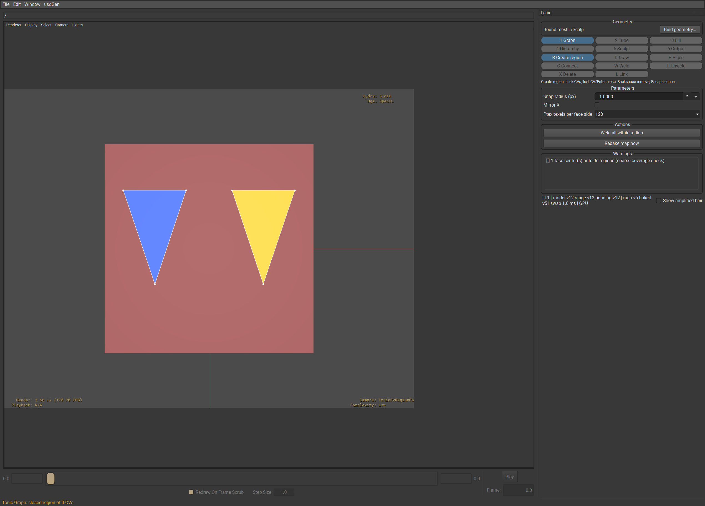

# Tonic authoring tool (usdGenTonicTools)

A usdview plugin for authoring Tonic-parity grooms: draw regions on a
scalp, grow tubes, fill them with guides, subdivide into hierarchies, sculpt
and commit the result as ordinary USD (`UsdGenGroom` + `GuideInterpolate` +
`RegionMap`) that the usdGen description amplifies downstream. Tubes are
authoring-side only — no usdGen kernel reads them; the commit carries
guides, regions and maps to the stage.

Tonic is **one viewport tool**, not a menu. Almost everything an artist does
is a mode, a sub-mode, a hotkey or a panel field inside one dockable
workspace; the menu carries exactly five commands.

## Opening it

Open a stage with `bin/launch_usdview.ps1`, then, in the menu bar:

* **usdGen → Tonic → Open workspace** — docks the **Tonic** panel on the
  right and installs the viewport controller (mouse and keyboard) on the
  active StageView. Needs a stage open first.
* The dock's **Geometry** block stays visible while modes change. Click
  **Bind geometry…** to open a picker containing the usable Mesh prims in the
  current stage; the current selection is the initial choice when it is a
  usable mesh. Binding starts the commit and bake workers and switches the
  shelf to Graph mode. Replacing an edited binding asks for explicit
  confirmation because it clears that groom's regions and maps.
* **usdGen → Tonic → Bind scalp (selection)** is the menu shortcut for the
  same operation when a mesh prim is already selected. Every other mode needs
  a bound geometry.
* **usdGen → Tonic → Save groom…**, **Export center curves…**,
  **Import curves…** — see *Save, export, import* below.

No other menu item exists. Everything else — modes, parameters, one-shot
actions — lives in the dock or on a hotkey.

## The dock

Refresh the shot with
`bin/launch_usdview.ps1 -TestScript plugin/usdGenTonicTools/testenv/captureTonicCvRegions.py examples/tonic-single-quad.usda`.

`TonicWorkspace` is a persistent right-docked panel with seven stacked
blocks: the **Geometry** block (the bound mesh path and picker); the **mode
shelf** (six checkable buttons, `1`–`6`); the active mode's
**sub-mode shelf** (hidden for Output); a generated **Parameters** form
whose fields read and write the model live; an **Actions** block of the
mode's one-shot buttons (Output's build and file actions live here too); a
**Warnings** list (click a row to select what it names); and a **status
strip** with **Show generated curves** and **Show amplified hair** checkboxes.
The dock refreshes after
every publish and on a 250 ms timer while visible, and a refresh that
finds a different active mode rebuilds the shelves, the rows and the
buttons — so a mode switched with a number key over the viewport is the
mode the dock shows.

While the dock is visible and active, it suppresses StageView rollover
picking and its hover tooltip so Tonic owns hover feedback. Closing or hiding
the dock restores the prior StageView rollover setting; uninstalling the
controller also restores it.

## The mode shelf (`1`–`6`)

| Key | Mode | Component selection / tools |
|---|---|---|
| `1` | Graph | Create region `R`, Draw `D`, Place `P`, Reposition `M`, Connect `C`, Weld `W`, Unweld `U`, Delete `X`, Link `L` |
| `2` | Tube | Whole Tube `F8`, Center CV `F9`, Ring `F10`, Section CV `F11`; Select `Q`, Move `W`, Rotate `E`, Scale `R` |
| `3` | Fill | Params `P`, Preview `V` |
| `4` | Hierarchy | Navigate `N`, Subdivide `D`, Merge `M`, Group `G`, Levels `L` |
| `5` | Sculpt | Grab `G`, Smooth `S`, Comb `C`, Lengthen `L`, Twist `T` |
| `6` | Output | — (panel only, no viewport gesture) |

A Tube selection row provides **Whole Tube** (`F8`), **Center CV** (`F9`),
**Ring** (`F10`), and **Section CV** (`F11`) component selection. Its
**Selection shape** field chooses Box (the default) or Lasso; Shift adds to
the current component selection. The **Transform tool** field selects
`Q` Select, `W` Move, `E` Rotate, or `R` Scale. These keys fire while the
pointer sits over the viewport and no text field has focus. Switching modes
drops any live gesture and resets the sub-mode to the new mode's default;
leaving a mode also takes its gizmo, brush ring and hover highlight off screen.
Visible component dots follow the active choice: F8 Whole Tube shows no
component dots, F9 shows center CV dots, and F10/F11 show section control dots;
the centerline guide may remain visible.

## Global hotkeys

| Key | Action |
|---|---|
| `Escape` | Cancel the live gesture, restoring the press-time shape exactly; with nothing live, clears the selection instead. |
| `Ctrl+Z` / `Ctrl+Y` | Undo / redo the model. |
| `Delete` | Delete the current mode's selection (nodes/edges, center CVs/rings, or tubes). |
| `[` / `]` | Shrink/grow the active mode's radius — snap (Graph), soft-selection `t` (Tube), preview fraction (Fill), pick radius (Hierarchy), brush radius (Sculpt). |
| `Shift+D` / `Shift+M` | Subdivide / merge-children the selected tube(s). |
| `Ctrl+Down` / Hierarchy double-click | Enter the level below; Tube double-clicks stay in Tube editing. |
| `Ctrl+Up` | Exit to the level above. `Backspace` does the same except in Graph → Create region, where it removes the most recent draft CV. |
| `Shift+W` / `Shift+U` | Weld the two selected graph nodes / unweld the one selected shared node. |
| `Ctrl+Shift+S` | Save groom (prompts for a file). |
| `Alt`-drag / `Meta`-drag | Always the camera, in every mode. |

In Graph's **Create region** sub-mode, `Enter` closes the draft after at
least three CVs and `Backspace` removes its most recently clicked CV. These
keys are draft operations only; they do not change the graph until the
region closes.

`F` is left to usdview's own Frame Selected — it is not a sub-mode letter in
any mode, so it falls through untouched.

## Selection, gizmos and gestures, per mode

Selection drags show a visible, mouse-transparent Qt `QRubberBand` marquee,
so the StageView still receives the gesture. Graph uses `Shift`-drag to select
graph CVs;
plain clicks in **Create region** remain CV-authoring clicks. Tube gives
component CV hits fixed 8 px priority and prehighlights the candidate. A body
drag starts the selected Box or Lasso marquee instead of being stolen by a
whole-tube click; `Shift` adds to the current component selection.
Other selection loops use the same visible marquee without intercepting the
viewport. Selection, hover, and gizmo changes request an immediate viewport
redraw. A geometry drag never touches the stage — only the release enqueues a
commit.

### Graph — draw regions on the scalp

Regions are the foundation; start here after binding geometry. Graph opens in
**Create region** (`R`) by default. Click successive positions on the scalp
to place transient CVs. Click the first CV, or press `Enter`, to close a
three-or-more-CV contour as one region and commit one undo step. `Backspace`
removes the last uncommitted CV; `Escape` discards the draft. A closed region
is rasterised and receives its L1 root/tube automatically. Clicking within an
existing graph CV's pick radius reuses that exact graph node in the new
contour, including a CV already shared by another region, so adjacent regions
can share the same boundary instead of accumulating coincident CVs.

* **Draw** (`D`) remains the freehand workflow: press-drag a stroke; release
  commits it. Ends within the snap radius of a node or edge weld
  automatically; a stroke that closes on itself splits the region it crosses.
* **Place** — click empty scalp to add a node; drag an existing node to
  move it (dropping it on another node or an edge welds or splits into it).
* **Reposition** (`M`) — drag an existing graph CV or a whole edge along the
  scalp. A rigid whole-region move carries the attached tube and all
  subdivided descendants by one translation/rotation, preserving sculpted
  centers, sections, and child offsets while the base stays aligned to its
  support plane. When a CV or edge move changes the region footprint, the
  existing tube base is refit to that footprint, upper sculpting is retained,
  and generated subdivided attachments are refreshed; an imported tube with an
  explicit authored shape is preserved. A shared boundary updates both owning
  subtrees; unrelated regions stay unchanged. Empty clicks do nothing and this
  tool never auto-welds. The live preview is one undo step; `Escape` cancels
  it to the press-time shape.
* **Connect** — click two nodes in turn to join them with a geodesic edge.
* **Weld** / **Unweld** — click two nodes to merge them, or a shared node
  to split it back per region (`Shift+W`/`Shift+U` do the same to the
  current selection).
* **Delete** — click a node or edge to remove it.
* **Link** — click two regions in turn to share one interpolation id.

Shift-drag opens a node marquee regardless of sub-mode. Every committed edit
re-rasterises the graph, gives newly closed regions their tube stub, enqueues
a commit and a map bake, and refreshes the coverage/intersection warnings.

Parameters: **Snap radius (px)**, **Mirror X**, and **Ptex texels per face
side**. Graph and Output show the same live bake control: `auto`, or an
explicit `4`, `8`, `16`, `32`, `64`, `128`, `256`, `512`, `1024`, `2048`, or
`4096` texels per side. Changing it rebakes immediately. Actions: **Weld all
within radius**, **Rebake map now**.

### Tube — sculpt center curves and section rings

Each closed region grows one L1 tube, including a region occupying only part
of a coarse scalp face. Root sampling tests the graph region itself, so
separate subface regions retain separate root support and each closed region
gets its own auto-tube. New region tubes default to **Match region CVs**
(Auto); artists do not need to enter a numeric zero. The tube has one
longitudinal column for each ordered region CV, with its base following the
polygon's projected fitted support plane. A higher **Ring CV count** adds edge
controls while preserving the region corners; construction does not use a
polar or averaged fit. Existing sculpted tubes are not regenerated when this
setting changes. Regions with more than 32 CVs retain their authored graph and
  report the 32-CV construction limit. A body click selects the whole tube
when it is not the start of a marquee; fixed-priority center CV, ring, and
Section CV hits select that item on the reported tube, including a real child
tube, and prehighlight before the press makes the target clear.

* **Center** — a translate gizmo sits at the selection's midpoint,
  screen-aligned. Drag an axis handle to constrain the move, drag the
  centre disc to move freely in the screen plane, or hold `Ctrl` on the
  disc to constrain along the tube's own root tangent. A selected whole
  tube translates rigidly; selected CVs move individually, or spread with
  the panel's **Soft-selection radius (t)** falloff around the clicked CV.
* **Ring** — the selected ring is edited in its own cross-section frame. The
  active Transform tool determines the operation: **Move** uses the in-plane
  axes or plane handle, **Rotate** uses the rotation handle around the ring
  pivot, and **Scale** uses the scale handle for uniform or axis-constrained
  scale. The projected ring/ellipse remains the visible handle when the view
  is edge-on.
* **Section CVs** — click selects one ring CV; the same gizmo drags only that
  individual CV inside the ring's plane. **Move**, **Rotate**, and **Scale**
  apply to the selected CV around its owning ring frame. Selecting or
  hovering a center CV, ring, or Section CV also highlights its owning tube
  mesh; a selected center CV or Section CV therefore gives both the local CV
cue and the owning-tube highlight, including for child tubes.

Centered section-core handles use the actual section-area centroid, while the
edit remains attached to the same selected center CV.

`Delete` removes selected center CVs, else selected rings. Guides refill at
preview density on every move, full density on release; `Escape` restores
the press-time shape and guides bit-exactly. The viewport requests a redraw on
each drag sample, while the commit and full-density refill remain release/idle
work.

Parameters: **Selection shape**, **Transform tool**, **Soft-selection radius (t)**,
**Display segments**, **Ring CV count** (used for newly constructed region
tubes, not retroactively), and **Selected section scale** (a numeric uniform scale for
the selected rings or the owning rings of selected Section CVs). Actions:
**Match surface**, **Relax**,
**Snap root to scalp** — each applies to the selected tube(s), or the primary
tube if none are selected.

### Fill — guide density and the length ramp

* **Params** — click a tube (body or guide) to select it for the form; the
  density, CV count, edge bias, seed and length-profile fields then apply
  to the selection (or the primary tube with nothing selected).
* **Preview** — press on a tube or its guides and drag up/down to
  lift/drop the length ramp at the `t` under the cursor (knots snap to a
  0.05 grid); release writes the ramp to every selected tube and refills at
  full density.

Fill carries each root through the actual section polygons, including their
CV positions, scale and twist. At full length, the guide tips follow the last
ring; a shorter length profile ends within the corresponding section interval.

Parameters: **Density**, **CV count**, **Edge bias**, **Seed**, **Length
profile** (a `pos:val, pos:val, …` ramp), **Preview fraction**, **Freeze
roots**. **Clear generated curves** removes generated guide output from the
model while keeping authored tubes; the committed suppression is undoable.
**Show generated curves** controls visibility independently. Clear suppresses
automatic refill until the explicit **Refill guides** action, which regenerates
the output. Hidden generated curves are not pick targets; authored tubes and
their CVs remain editable.

### Hierarchy — subdivide and navigate levels

* **Navigate** — click selects a tube; Shift-drag marquees several;
  double-click enters the clicked tube's children's level (or stays put)
  and selects them. This is explicit Hierarchy navigation; a rapid Tube
  double-click never enters a hierarchy level.
* **Subdivide** — with **Split mode** `kmeans` (default), `Shift+D` or
  **Subdivide** splits the selection into **Subdivide count** (2–8)
  children by **Subdivide seed**; the new children become the selection and
  focus moves to their level. With `edge` mode, first drag a stroke across
  the root region (very short strokes are rejected); `Shift+D` then splits
  along the recorded edge.
* **Merge** — `Shift+M`/**Merge children** folds a tube's children back
  (a selected child walks up to its parent first). **Merge selected** folds
  two or more selected siblings into one. **Re-subdivide** is a two-step
  confirm: the first press reports what would be lost, the second does it.
* **Group** — select two or more tubes, press **Group** for an on-the-fly
  parent; **Make persistent** commits it into the groom.
* **Levels** — no gesture; **Solo level**, **Show ≤ level**, **L*n*
  visible**, **L*n* x-ray** drive per-level visibility/x-ray model-wide.

**Enter/Exit level** (also `Ctrl+Down`/`Up`, a Hierarchy double-click, or a
breadcrumb click) walk the focus depth. Entering a selected tube's child level selects
its children; exiting restores the corresponding parent selection. `Backspace`
exits a level except while Graph's Create region draft is active. **Lock parents**/**Lock
children** gate K6/K7 propagation per selected tube, or globally with none
selected. Warnings fire post-gesture: a **smoothness** spike is a
center-CV bend sharper than 15° between segments; a **root intersection**
lists tubes whose root rings overlap in area.

Levels are branch-local. Entering root A exposes only A's children, so a
separate root B can remain at its current frontier; the view can therefore
show A at L2 while B remains at L1. Exiting A restores A's parent selection
and visibility without changing B. Whole-tube Move applies one atomic
translation; parent updates preserve each child's sculpted centers, sections,
offsets, and individual CV offset slots. K7 inherits only the original outer
boundary from L1 to drive the parent layout; internal sibling edges and added
L2 detail remain child edits, with no full-volume refit. Editing a child
remains local while the parent layout is preserved. Holding a boundary is
exact when the target is coplanar with existing L1 sections; bent or
non-coplanar inherited edges use the existing planar sections' projection
instead of claiming an arbitrary 3D edge fit.

### Sculpt — hierarchical brushes over center curves

A brush ring follows the cursor near the scalp or a tube. Press first picks the
nearest center CV inside the brush radius; if no CV is hit, clicking a visible
tube body supplies its owning tube as the sculpt target. With no tube body
under the brush, the ring can fall back to the scalp surface, but the press
does not start a stroke. Every move strokes the chosen tube:

* **Grab** — CVs follow the cursor's world-space delta, scaled by **Brush
  strength**.
* **Comb** — a fixed push per move sample along the drag direction (not
  proportional to speed), scaled by **Brush strength**.
* **Smooth** — relaxes each CV toward its neighbours' mean; **Brush
  strength** (0–1) sets how far.
* **Lengthen** — drag up/down to grow/shrink the tube, root pinned.
* **Twist** — drag right/left to rotate offsets about the chord axis.

At press, Sculpt freezes the active plane and camera/depth context for the
stroke. Grab also freezes the initial CV weights through background updates;
its ring stays camera-facing at the cursor. The other brushes apply their
screen-space footprint against that press context. Every brush honours **Brush
strength**, **Preserve length**, **Mirror X** and **Brush t radius** (0 = whole
tube). `Escape` restores the pre-stroke shape bit-exactly. Sculpt has no
one-shot action — every edit is a stroke.
Hold `F` and drag horizontally with the left mouse button to resize the Sculpt
brush live; the radius changes during the drag.
Parameters: **Brush radius (px)**, **Brush t radius**, **Preserve length**,
**Brush strength**, **Mirror X**.

### Output — maps and file commands, no gesture

No sub-mode shelf, no viewport loop. Output is a result view: authoring tube
walls, center controls, and generated guide helpers are hidden so they cannot
occlude the generated strands. **Show amplified hair** independently controls
the committed generated result; before the first build there is no guide
fallback in this mode. Parameters: **Ptex texels per face
side** — `auto` uses the bake's area-based plan, keeps region-boundary faces
at least 64×64 so a region contained within a coarse face remains
representable, and conservatively collapses a face to 1×1 only when its
samples are uniform and no boundary can affect it. Any explicit choice from
`4` through `4096` forces that many texels per face side over the whole
scalp. Graph and Output are synchronized, and a change rebakes immediately
rather than waiting for the next graph edit. The other parameter is **Show
amplified hair** (mirrors the status strip's checkbox). **Build/update
description** enables the committed output and exposes **Description density**
and **Strand width**. Density `1` uses the tube's Fill density; other values
scale the generated strand count without changing the sparse source curves.
The build writes sparse tube-shape guides to `<groom>/OutputCurves`, bakes
their ownership into `<groom>/OutputRegionMap`, and creates the instanced
description under `<groom>/Output`. Its `CurveSource` interpolates new strands
from the sparse guides at cook time, followed by `Width`. The PTex map keeps
roots within their owning region and subdivided tube. The curves, map and
description update together; saving flushes the newest commit and includes
the map asset.

**Show amplified hair** only controls visibility. Clearing or hiding generated
guides does not remove or regenerate the committed description. After the first
build, tube, region, and Sculpt edits regenerate the Output automatically on
commit while the model is live. A saved sparse output can generate hair without
the model; reopening the model and pressing **Build/update description**
activates or rebuilds it when needed.
Actions: **Build/update description**, **Save groom…**, **Export center
curves…**, **Import curves…**, each a one-shot action or file dialog as
labelled.

A forced resolution costs what it says: on the 64-face reference scalp a
bake is about 43 ms at 128 texels per side and about 1 s at 1024. It is
a debugging and hero-bake control, not something to leave on.

## Warnings

* **Coverage (coarse check)** — `N face center(s) outside regions (coarse
  coverage check)`; this reports the coarse face-center diagnostic and does
  not say that every subface point on that face is uncovered.
* **Root intersections** — overlapping root rings, listed by tube id.
* **Smoothness** — CVs past the 15° spike threshold.
* **CPU-only** (info) — why the GPU mirror fell back.
* **Committer detached** (error) — the stage went away under the tool.

Clicking a coverage-causing or intersection/smoothness row selects the
tubes or CVs it names.

## Status strip and the amber skew rule

Left to right: the clickable breadcrumb, the focused level, `model v<X>
stage v<Y> pending v<Z>`, `map v<A> baked v<B>`, the last swap time, and
`GPU` or `CPU-only (<reason>)`; `fidelity step N` is appended once the
ladder has stepped down. It turns **amber** with `[MAP BEHIND]` appended
whenever the baked map trails the enqueued map, or the committed stage
trails the model — both expected, momentary states that clear once the next
pump lands.

The **Show amplified hair** checkbox beside the strip is what actually calls
`Tonic_SetAmplifiedHair` on the model, controlling visibility of committed
usdGen tiles. **Build/update description** creates the self-contained Output
description that supplies those tiles; the Output panel field of the same
name mirrors the checkbox state.

## Undo and redo

Every tube, hierarchy and graph edit — moves, sculpts, subdivides, merges,
groups, section work, imports, strokes, welds, splits, deletes, region
links — pushes one pre-edit snapshot. A drag is **one** undo step: the loop
opens a bracket at press and seals it at release; `Escape` mid-drag
restores the press-time base instead of sealing anything. If a gesture is
interrupted, the controller cancels and rolls it back; a normal mouse leave
while a drag is held keeps that drag active. `Ctrl+Z`/`Ctrl+Y`
walk the stack; any new edit clears the redo side. Not covered: the
selection itself and deterministic guide refills.

## The viewport look

Follows the published Tonic stills — the WDAS technology-page hero,
Simmons & Whited (EG 2014) Fig. 1(c)–(e), Kaur, Simmons & Whited (SIGGRAPH
2018) Figs. 1, 2, 4, and Kaur et al. (SIGGRAPH 2024) Fig. 1:

* **Tubes** are opaque and smoothly shaded, one saturated colour per clump
  (a fixed 16-entry palette by L1 region id; children shift lightness
  within the parent's hue), no wireframe, no level tint. X-rayed levels
  draw at a quarter opacity, same hue.
* **Scalp regions** paint in the same palette, so a scalp patch and its
  rooted tube match.
* **Graph mode** hides tube geometry so the scalp patches and graph edges read
  cleanly. The patch overlay follows the authored region boundaries; it is an
  authoring display, not a claim of pixel-identical output to the reference.
* **Center curves** are thick in the clump colour on the focused level,
  thinner elsewhere; **CVs** are round dots, larger on the focused level;
  selections brighten and rim.
* **Rings** and their CVs draw thin, shown in Tube mode's Ring/Section
  sub-modes and on any selected tube elsewhere.
* **Guides** draw thin in their clump colour; amplified tiles replace them
  when **Show amplified hair** is on.
* **Gizmos** follow Maya convention; the **brush ring** is a thin
  screen-facing circle at the cursor.

The screen-space gizmo geometry adapts the upstream material in
`../usdRig/usdRig` (RigExec's `gizmoScreen.py`); this repository has no
`../usdGen/usdGen` source tree to attribute. The shared geometry is consumed
by the Qt overlay with the Hydra scene-index path as fallback.

What draws depends on the mode — the tool shows either solid tubes or
control curves through x-rayed tubes, never both:

| Mode | Focused level | Other levels | Guides |
|---|---|---|---|
| Graph | scalp patches and graph edges; tube geometry hidden | tube geometry hidden | off |
| Output | generated result when shown; tube walls and center controls hidden | generated result when shown; helper geometry hidden | off |
| Tube · Ring/Section | opaque, curves on | x-rayed | off |
| Tube · Center, Hierarchy, Sculpt | x-rayed, curves on | x-rayed fainter | off |
| Fill | x-rayed, curves on | x-rayed, curves on | on |

(Rings draw on every tube in Tube's Ring/Section sub-modes, and on
selected tubes elsewhere.) The look comes from one policy table the
controller pushes on every mode, sub-mode or focus change, so switching
modes is all it takes to move between these rows.

## What runs automatically

Two worker threads keep the stage in sync; neither blocks a gesture, and
the viewport's idle pump (roughly every 50 ms while work is pending) drains
them:

* **Commit worker** — snapshots the model off-thread on release, builds the
  groom layer anonymously; the pump swaps it into the live sublayer. A full
  swap at the reference scene (2 400 tubes, 12 000 guides) costs about
  104 ms, so the committer falls back to a **partial transfer** — one tube
  subtree per idle slot, each under roughly 2.3 ms.
* **Bake worker** — bakes the region map to versioned `.ptx` files on its
  own CUDA stream, swapped with one attribute author each.
* **Guide refill cache** — a per-tube content hash means a one-CV move only
  refills that tube's guides: at reference scale, a one-tube version fell
  from 35.5 ms of worker time (every tube refilled) to 2.4 ms (one tube).
* **The fallback ladder** — the controller times each move end to end.
  Three *consecutive* moves over the 8 ms budget step it one rung: guide
  preview 25 % → 10 % → 0 %, then display segments halved, then non-focused
  levels as centers only, then hover off. One in-budget move resets the
  count; release always restores full fidelity. Measured at 1.16–1.30
  ms/move over a 36-tube subtree, the ladder never leaves step 0 at tested
  scales — it exists for grooms roughly a magnitude heavier.

Because the bake lands after the commit carrying the same graph change,
the amplified preview can briefly cook against the previous map — the amber
skew window above, accepted by design. If the GPU mirror fails, the model
drops to the CPU host mirror with identical results; the warnings list and
status strip report it, and the tool keeps working.

## Save, export, import

* **Save groom…** writes the live layer to a `.usdc` (never `.usda`) and
  re-parents it under the live sublayer; a baked map is copied beside it
  and referenced with a relative `./regionMap.ptx` path.
* **Export center curves…** writes the focused level's tube centers as
  `BasisCurves` to a chosen file.
* **Import curves…** reads every `BasisCurves` in a file and adds them as
  locked child tubes under the selected (or primary) tube — the reverse of
  export, reproducing the Tonic ↔ Houdini braid round trip.

All three live under **usdGen → Tonic** and, redundantly, in Output mode's
Actions block.

## Stage reloads

If the stage closes or reloads under the tool, the committer detaches: the
warnings list reports it, stage swaps stop, and the model — every edit and
the undo stack — survives untouched. **Reattach** happens automatically
when a new stage appears: it re-hosts the live sublayer and the next idle
swap re-creates the groom from the surviving model (post-detach edits
included), filling an existing groom prim in place rather than duplicating
it.

## Deferred, not built

Two plan/17 features are deliberately deferred, for one shared reason —
what a brush stroke *means* in a hierarchy is one decision, not two:

* **Guide brushes.** Sculpt reaches center curves only, never guides
  directly, because `<groom>/Guides` is a reproducible stage contract (the
  committer writes exactly what the fill kernels generate, and hydrate
  bit-compares a regeneration); guide deltas would make it authored data no
  fill can reproduce, which is a schema and hydrate change of its own.
* **Hierarchy soft selection.** Soft selection along one tube's center
  works everywhere; spreading one move across neighbouring tubes by hop
  distance is not built, because it collides with the K6/K7 propagation
  running on the same move.

## Troubleshooting

* **Amber `[MAP BEHIND]`** — bake or commit is a version behind; wait, or
  press **Rebake map now** (Graph). Harmless by design.
* **No hair on some faces** — coverage warning names them; extend a
  boundary or link a neighbouring region.
* **Kink warnings** — Sculpt's Smooth or a Tube Ring-scale pass usually
  clears them; anything past 15° stays listed until fixed.
* **A drag feels heavy** — check the status strip for `fidelity step N`
  (the ladder is already stepping down); Solo the edited level
  (Hierarchy → Levels) to cut what else draws.
* **CPU-only banner** — GPU mirror dropped (reason in the warnings list);
  results are identical; restart the tool to retry the GPU.
* **An edit was rejected** — the tube partition could not divide cleanly;
  nothing changed. If a follow-up also refuses, undo past the edit that
  led here and retry with a smaller nudge.
* **Merge won't split back** — merging sculpted children bakes them into
  the parent, usually a one-way door (pristine children still round-trip
  through Re-subdivide). Treat merge as a late step, or undo it.
* **Committer detached** — see *Stage reloads*; reattachment is automatic.
* **A thin green line through the tubes** — that is usdview's own origin
  axes (the +Y axis is pure green), not groom content. They draw in
  every viewport with no toggle; opaque tubes occlude them and x-rayed
  tubes do not, so they only show in the x-ray modes above. The
  reference screenshots turn them off for the shot.
