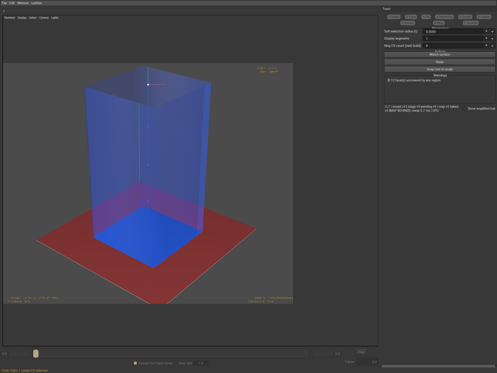

# Tonic authoring tool (usdGenTonicTools)

A usdview plugin for authoring Tonic-parity grooms: draw regions on a
scalp, grow tubes, fill them with guides, subdivide into hierarchies, sculpt
and commit the result as ordinary USD (`UsdGenGroom` + `GuideInterpolate` +
`RegionMap`) that the usdGen description amplifies downstream. Tubes are
authoring-side only — no usdGen kernel reads them; the commit carries
guides, regions and maps to the stage.

Tonic is **one viewport tool**, not a menu. Almost everything an artist does
is a mode, a sub-mode, a hotkey or a panel field inside one dockable
workspace; the menu carries exactly five commands.

## Opening it

Open a stage with `bin/launch_usdview.ps1`, then, in the menu bar:

* **usdGen → Tonic → Open workspace** — docks the **Tonic** panel on the
  right and installs the viewport controller (mouse and keyboard) on the
  active StageView. Needs a stage open first.
* **usdGen → Tonic → Bind scalp (selection)** — select a mesh prim, then run
  this. It creates the Tonic model, binds the selection as the scalp,
  starts the commit and bake workers, and switches the shelf to Graph mode.
  Do this before anything else; every other mode needs a bound scalp.
* **usdGen → Tonic → Save groom…**, **Export center curves…**,
  **Import curves…** — see *Save, export, import* below.

No other menu item exists. Everything else — modes, parameters, one-shot
actions — lives in the dock or on a hotkey.

## The dock

Refresh the shot with
`bin/launch_usdview.ps1 -TestScript plugin/usdGenTonicTools/testenv/captureTonicWorkspace.py examples/tonic-graph-scalp.usda`.

`TonicWorkspace` is a right-docked panel with six stacked blocks: the
**mode shelf** (six checkable buttons, `1`–`6`); the active mode's
**sub-mode shelf** (hidden for Output); a generated **Parameters** form
whose fields read and write the model live; an **Actions** block of the
mode's one-shot buttons (Output's three file actions live here too); a
**Warnings** list (click a row to select what it names); and a **status
strip** with a **Show amplified hair** checkbox. The dock refreshes after
every publish and on a 250 ms timer while visible, and a refresh that
finds a different active mode rebuilds the shelves, the rows and the
buttons — so a mode switched with a number key over the viewport is the
mode the dock shows.

## The mode shelf (`1`–`6`)

| Key | Mode | Sub-modes (hotkey) |
|---|---|---|
| `1` | Graph | Draw `D`, Place `P`, Connect `C`, Weld `W`, Unweld `U`, Delete `X`, Link `L` |
| `2` | Tube | Center `C`, Ring `R`, Section `E` |
| `3` | Fill | Params `P`, Preview `V` |
| `4` | Hierarchy | Navigate `N`, Subdivide `D`, Merge `M`, Group `G`, Levels `L` |
| `5` | Sculpt | Grab `G`, Smooth `S`, Comb `C`, Lengthen `L`, Twist `T` |
| `6` | Output | — (panel only, no viewport gesture) |

A sub-mode letter only fires while the pointer sits over the viewport and no
text field has focus. Switching modes drops any live gesture and resets the
sub-mode to the new mode's default; leaving a mode also takes its gizmo,
brush ring and hover highlight off screen.

## Global hotkeys

| Key | Action |
|---|---|
| `Escape` | Cancel the live gesture, restoring the press-time shape exactly; with nothing live, clears the selection instead. |
| `Ctrl+Z` / `Ctrl+Y` | Undo / redo the model. |
| `Delete` | Delete the current mode's selection (nodes/edges, center CVs/rings, or tubes). |
| `[` / `]` | Shrink/grow the active mode's radius — snap (Graph), soft-selection `t` (Tube), preview fraction (Fill), pick radius (Hierarchy), brush radius (Sculpt). |
| `Shift+D` / `Shift+M` | Subdivide / merge-children the selected tube(s). |
| `Ctrl+Down` / double-click | Enter the level below (double-click enters the clicked tube's level). |
| `Ctrl+Up` / `Backspace` | Exit to the level above. |
| `Shift+W` / `Shift+U` | Weld the two selected graph nodes / unweld the one selected shared node. |
| `Ctrl+Shift+S` | Save groom (prompts for a file). |
| `Alt`-drag / `Meta`-drag | Always the camera, in every mode. |

`F` is left to usdview's own Frame Selected — it is not a sub-mode letter in
any mode, so it falls through untouched.

## Selection, gizmos and gestures, per mode

Every mode shares three conventions: a plain click sets the selection,
Shift adds to it, and (outside a handle) Ctrl toggles it; dragging over
empty space opens a marquee box; and a drag never touches the stage — only
the release enqueues a commit.

### Graph — draw regions on the scalp

Regions are the foundation; start here after Bind scalp.

* **Draw** — press-drag a stroke; release commits it. Ends within the snap
  radius of a node or edge weld automatically; a stroke that closes on
  itself splits the region it crosses.
* **Place** — click empty scalp to add a node; drag an existing node to
  move it (dropping it on another node or an edge welds or splits into it).
* **Connect** — click two nodes in turn to join them with a geodesic edge.
* **Weld** / **Unweld** — click two nodes to merge them, or a shared node
  to split it back per region (`Shift+W`/`Shift+U` do the same to the
  current selection).
* **Delete** — click a node or edge to remove it.
* **Link** — click two regions in turn to share one interpolation id.

Shift-drag opens a node marquee regardless of sub-mode. Every edit
re-rasterises the graph, gives newly closed regions their tube stub,
enqueues a commit and a map bake, and refreshes the coverage/intersection
warnings.

Parameters: **Snap radius (px)**, **Mirror X**. Actions: **Weld all within
radius**, **Rebake map now**.

### Tube — sculpt center curves and section rings

Each closed region grows one L1 tube. Clicking a tube's body selects the
whole tube; clicking a CV or ring selects that item.

* **Center** — a translate gizmo sits at the selection's midpoint,
  screen-aligned. Drag an axis handle to constrain the move, drag the
  centre disc to move freely in the screen plane, or hold `Ctrl` on the
  disc to constrain along the tube's own root tangent. A selected whole
  tube translates rigidly; selected CVs move individually, or spread with
  the panel's **Soft-selection radius (t)** falloff around the clicked CV.
* **Ring** — the gizmo becomes a ring handle set: the two in-plane axes
  translate the ring in its own cross-section plane, the ring itself scales
  uniformly, and the third axis twists it (a section chart is
  two-dimensional, so there is no third translation to give that axis).
* **Section** — click selects one ring CV; the same gizmo drags it inside
  the ring's plane.

`Delete` removes selected center CVs, else selected rings. Guides refill at
preview density on every move, full density on release; `Escape` restores
the press-time shape and guides bit-exactly.

Parameters: **Soft-selection radius (t)**, **Display segments**, **Ring CV
count (next build)** (used the next time an auto-tube is built, not
retroactively). Actions: **Match surface**, **Relax**, **Snap root to
scalp** — each applies to the selected tube(s), or the primary tube if none
are selected.

### Fill — guide density and the length ramp

* **Params** — click a tube (body or guide) to select it for the form; the
  density, CV count, edge bias, seed and length-profile fields then apply
  to the selection (or the primary tube with nothing selected).
* **Preview** — press on a tube or its guides and drag up/down to
  lift/drop the length ramp at the `t` under the cursor (knots snap to a
  0.05 grid); release writes the ramp to every selected tube and refills at
  full density.

Parameters: **Density**, **CV count**, **Edge bias**, **Seed**, **Length
profile** (a `pos:val, pos:val, …` ramp), **Preview fraction**, **Freeze
roots**. Action: **Refill guides**.

### Hierarchy — subdivide and navigate levels

* **Navigate** — click selects a tube; Shift-drag marquees several;
  double-click enters the clicked tube's children's level (or stays put)
  and selects them.
* **Subdivide** — with **Split mode** `kmeans` (default), `Shift+D` or
  **Subdivide** splits the selection into **Subdivide count** (2–8)
  children by **Subdivide seed**. With `edge` mode, first drag a stroke
  across the root region (very short strokes are rejected); `Shift+D` then
  splits along the recorded edge.
* **Merge** — `Shift+M`/**Merge children** folds a tube's children back
  (a selected child walks up to its parent first). **Merge selected** folds
  two or more selected siblings into one. **Re-subdivide** is a two-step
  confirm: the first press reports what would be lost, the second does it.
* **Group** — select two or more tubes, press **Group** for an on-the-fly
  parent; **Make persistent** commits it into the groom.
* **Levels** — no gesture; **Solo level**, **Show ≤ level**, **L*n*
  visible**, **L*n* x-ray** drive per-level visibility/x-ray model-wide.

**Enter/Exit level** (also `Ctrl+Down`/`Up`, `Backspace`, double-click, or
a breadcrumb click) walk the focus depth. **Lock parents**/**Lock
children** gate K6/K7 propagation per selected tube, or globally with none
selected. Warnings fire post-gesture: a **smoothness** spike is a
center-CV bend sharper than 15° between segments; a **root intersection**
lists tubes whose root rings overlap in area.

### Sculpt — hierarchical brushes over center curves

A brush ring follows the cursor near the scalp or a tube. Press picks the
nearest center CV inside the brush radius; every move strokes the brush:

* **Grab** — CVs follow the cursor's world-space delta.
* **Comb** — a fixed push per move sample along the drag direction (not
  proportional to speed), scaled by **Brush strength**.
* **Smooth** — relaxes each CV toward its neighbours' mean; **Brush
  strength** (0–1) sets how far.
* **Lengthen** — drag up/down to grow/shrink the tube, root pinned.
* **Twist** — drag right/left to rotate offsets about the chord axis.

Every brush honours **Preserve length**, **Mirror X** and **Brush t
radius** (0 = whole tube). `Escape` restores the pre-stroke shape
bit-exactly. Sculpt has no one-shot action — every edit is a stroke.
Parameters: **Brush radius (px)**, **Brush t radius**, **Preserve length**,
**Brush strength**, **Mirror X**.

### Output — maps and file commands, no gesture

No sub-mode shelf, no viewport loop. Parameters: **Texel resolution
override** — `auto` leaves the bake its own per-face plan (each face
sized by its area, a face wholly inside one region collapsed to a single
texel); any other choice forces that many texels per face side over the
whole scalp, and the map is rebaked at once rather than at the next graph
edit — and **Show amplified hair** (mirrors the status strip's checkbox).
Actions: **Save groom…**, **Export center curves…**, **Import curves…**,
each a file dialog.

A forced resolution costs what it says: on the 64-face reference scalp a
bake is about 43 ms at 128 texels per side and about 1 s at 1024. It is
a debugging and hero-bake control, not something to leave on.

## Warnings

* **Coverage** — `N face(s) uncovered by any region`; those faces grow no
  hair.
* **Root intersections** — overlapping root rings, listed by tube id.
* **Smoothness** — CVs past the 15° spike threshold.
* **CPU-only** (info) — why the GPU mirror fell back.
* **Committer detached** (error) — the stage went away under the tool.

Clicking a coverage-causing or intersection/smoothness row selects the
tubes or CVs it names.

## Status strip and the amber skew rule

Left to right: the clickable breadcrumb, the focused level, `model v<X>
stage v<Y> pending v<Z>`, `map v<A> baked v<B>`, the last swap time, and
`GPU` or `CPU-only (<reason>)`; `fidelity step N` is appended once the
ladder has stepped down. It turns **amber** with `[MAP BEHIND]` appended
whenever the baked map trails the enqueued map, or the committed stage
trails the model — both expected, momentary states that clear once the next
pump lands.

The **Show amplified hair** checkbox beside the strip is what actually
calls `Tonic_SetAmplifiedHair` on the model, running the usdGen description
over the committed guides for a preview (Output's panel field of the same
name is state only).

## Undo and redo

Every tube, hierarchy and graph edit — moves, sculpts, subdivides, merges,
groups, section work, imports, strokes, welds, splits, deletes, region
links — pushes one pre-edit snapshot. A drag is **one** undo step: the loop
opens a bracket at press and seals it at release; `Escape` mid-drag
restores the press-time base instead of sealing anything. `Ctrl+Z`/`Ctrl+Y`
walk the stack; any new edit clears the redo side. Not covered: the
selection itself and deterministic guide refills.

## The viewport look

Follows the published Tonic stills — the WDAS technology-page hero,
Simmons & Whited (EG 2014) Fig. 1(c)–(e), Kaur, Simmons & Whited (SIGGRAPH
2018) Figs. 1, 2, 4, and Kaur et al. (SIGGRAPH 2024) Fig. 1:

* **Tubes** are opaque and smoothly shaded, one saturated colour per clump
  (a fixed 16-entry palette by L1 region id; children shift lightness
  within the parent's hue), no wireframe, no level tint. X-rayed levels
  draw at a quarter opacity, same hue.
* **Scalp regions** paint in the same palette, so a scalp patch and its
  rooted tube match.
* **Center curves** are thick in the clump colour on the focused level,
  thinner elsewhere; **CVs** are round dots, larger on the focused level;
  selections brighten and rim.
* **Rings** and their CVs draw thin, shown in Tube mode's Ring/Section
  sub-modes and on any selected tube elsewhere.
* **Guides** draw thin in their clump colour; amplified tiles replace them
  when **Show amplified hair** is on.
* **Gizmos** follow Maya convention; the **brush ring** is a thin
  screen-facing circle at the cursor.

## What runs automatically

Two worker threads keep the stage in sync; neither blocks a gesture, and
the viewport's idle pump (roughly every 50 ms while work is pending) drains
them:

* **Commit worker** — snapshots the model off-thread on release, builds the
  groom layer anonymously; the pump swaps it into the live sublayer. A full
  swap at the reference scene (2 400 tubes, 12 000 guides) costs about
  104 ms, so the committer falls back to a **partial transfer** — one tube
  subtree per idle slot, each under roughly 2.3 ms.
* **Bake worker** — bakes the region map to versioned `.ptx` files on its
  own CUDA stream, swapped with one attribute author each.
* **Guide refill cache** — a per-tube content hash means a one-CV move only
  refills that tube's guides: at reference scale, a one-tube version fell
  from 35.5 ms of worker time (every tube refilled) to 2.4 ms (one tube).
* **The fallback ladder** — the controller times each move end to end.
  Three *consecutive* moves over the 8 ms budget step it one rung: guide
  preview 25 % → 10 % → 0 %, then display segments halved, then non-focused
  levels as centers only, then hover off. One in-budget move resets the
  count; release always restores full fidelity. Measured at 1.16–1.30
  ms/move over a 36-tube subtree, the ladder never leaves step 0 at tested
  scales — it exists for grooms roughly a magnitude heavier.

Because the bake lands after the commit carrying the same graph change,
the amplified preview can briefly cook against the previous map — the amber
skew window above, accepted by design. If the GPU mirror fails, the model
drops to the CPU host mirror with identical results; the warnings list and
status strip report it, and the tool keeps working.

## Save, export, import

* **Save groom…** writes the live layer to a `.usdc` (never `.usda`) and
  re-parents it under the live sublayer; a baked map is copied beside it
  and referenced with a relative `./regionMap.ptx` path.
* **Export center curves…** writes the focused level's tube centers as
  `BasisCurves` to a chosen file.
* **Import curves…** reads every `BasisCurves` in a file and adds them as
  locked child tubes under the selected (or primary) tube — the reverse of
  export, reproducing the Tonic ↔ Houdini braid round trip.

All three live under **usdGen → Tonic** and, redundantly, in Output mode's
Actions block.

## Stage reloads

If the stage closes or reloads under the tool, the committer detaches: the
warnings list reports it, stage swaps stop, and the model — every edit and
the undo stack — survives untouched. **Reattach** happens automatically
when a new stage appears: it re-hosts the live sublayer and the next idle
swap re-creates the groom from the surviving model (post-detach edits
included), filling an existing groom prim in place rather than duplicating
it.

## Deferred, not built

Two plan/17 features are deliberately deferred, for one shared reason —
what a brush stroke *means* in a hierarchy is one decision, not two:

* **Guide brushes.** Sculpt reaches center curves only, never guides
  directly, because `<groom>/Guides` is a reproducible stage contract (the
  committer writes exactly what the fill kernels generate, and hydrate
  bit-compares a regeneration); guide deltas would make it authored data no
  fill can reproduce, which is a schema and hydrate change of its own.
* **Hierarchy soft selection.** Soft selection along one tube's center
  works everywhere; spreading one move across neighbouring tubes by hop
  distance is not built, because it collides with the K6/K7 propagation
  running on the same move.

## Troubleshooting

* **Amber `[MAP BEHIND]`** — bake or commit is a version behind; wait, or
  press **Rebake map now** (Graph). Harmless by design.
* **No hair on some faces** — coverage warning names them; extend a
  boundary or link a neighbouring region.
* **Kink warnings** — Sculpt's Smooth or a Tube Ring-scale pass usually
  clears them; anything past 15° stays listed until fixed.
* **A drag feels heavy** — check the status strip for `fidelity step N`
  (the ladder is already stepping down); Solo the edited level
  (Hierarchy → Levels) to cut what else draws.
* **CPU-only banner** — GPU mirror dropped (reason in the warnings list);
  results are identical; restart the tool to retry the GPU.
* **An edit was rejected** — the tube partition could not divide cleanly;
  nothing changed. If a follow-up also refuses, undo past the edit that
  led here and retry with a smaller nudge.
* **Merge won't split back** — merging sculpted children bakes them into
  the parent, usually a one-way door (pristine children still round-trip
  through Re-subdivide). Treat merge as a late step, or undo it.
* **Committer detached** — see *Stage reloads*; reattachment is automatic.
